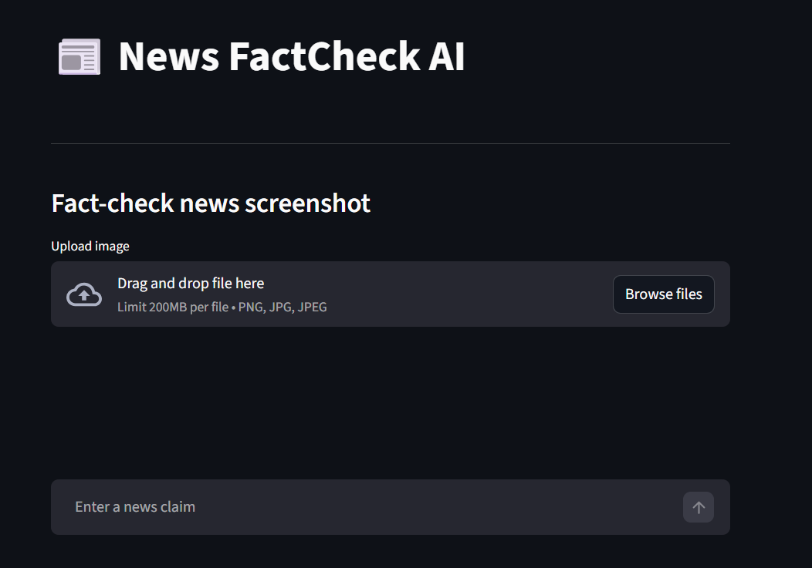
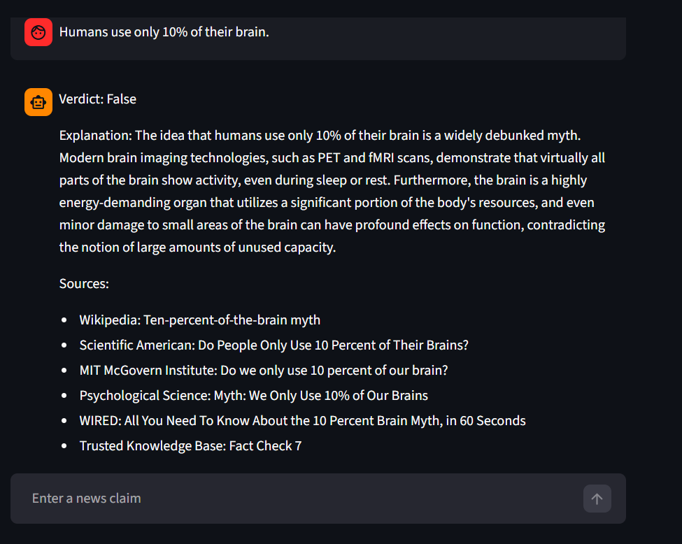
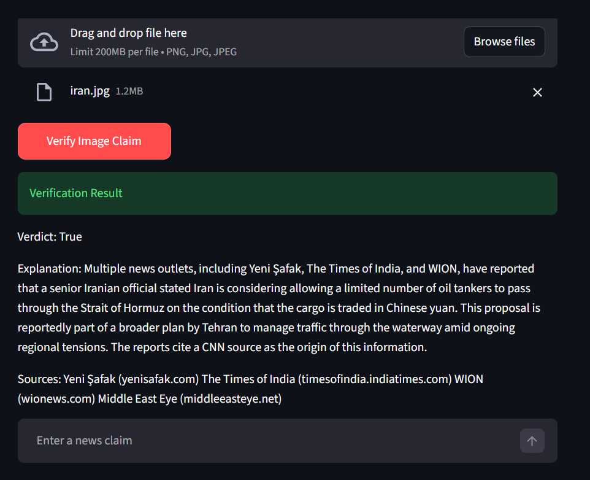
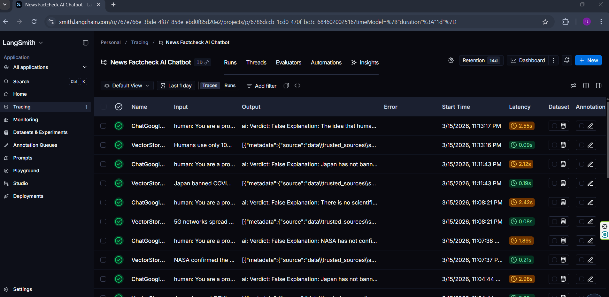

📰 News FactCheck AI Chatbot

An AI-powered chatbot that verifies the credibility of news claims using LLM reasoning, real-time web search, Retrieval-Augmented Generation (RAG), and OCR-based screenshot analysis.

This project demonstrates how modern AI tools can be integrated into a fact-checking assistant capable of analyzing both text claims and news screenshots.

 🚀 Features

 🤖 Interactive chatbot interface
 🌐 Real-time internet search for latest news
 🧠 Retrieval-Augmented Generation (RAG) with vector database
 🖼️ OCR-based screenshot fact-checking
 🔎 Multi-source evidence analysis
 📊 Structured verdict generation
 📈 AI workflow tracing and monitoring

 # 📸 Screenshots

## Chatbot Interface

## Fact Check Result

## OCR Screenshot Verification

## LangSmith Tracing

 🏗️ System Architecture

 User Input (Text / Image)
        │
        ▼
Streamlit Chat Interface
        │
        ▼
FactCheck Agent
        │
 ┌──────┼───────────┐
 ▼      ▼           ▼
Web Search     RAG Retrieval     OCR Extraction
(Tavily)       (Vector DB)       (Image Text)
        │
        ▼
Gemini LLM Reasoning
        │
        ▼
Fact Check Verdict
(True / False / Misleading / Unverified)

🧠 Technologies Used

| Component       | Technology            |
| --------------- | --------------------- |
| Chat Interface  | Streamlit             |
| LLM Reasoning   | Google Gemini         |
| Web Search      | Tavily                |
| Vector Database | Chroma                |
| OCR             | Tesseract OCR         |
| Monitoring      | LangSmith             |
| Embeddings      | Sentence Transformers |
| Backend         | Python + LangChain    |

📂 Project Structure

news-factcheck-ai
│
├── frontend
│   └── app.py
│
├── backend
│   ├── agents
│   │   └── factcheck_agent.py
│   │
│   ├── tools
│   │   ├── news_search_tool.py
│   │   ├── rag_tool.py
│   │   └── ocr_tool.py
│   │
│   └── prompts
│       └── factcheck_prompt.py
│
├── database
│   └── vector_store.py
│
├── ingestion
│   └── ingest_documents.py
│
├── data
│   └── trusted_sources
│       └── factchecks.txt
│
├── utils
│   └── config.py
│
├── screenshots
│   ├── chatbot_interface.png
│   ├── factcheck_result.png
│   ├── ocr_verification.png
│   └── langsmith_trace.png
│
├── requirements.txt
├── .env
└── README.md

## Run

pip install -r requirements.txt

python ingestion/ingest_documents.py

streamlit run frontend/app.py

📊 LangSmith Monitoring

This project integrates LangSmith tracing to monitor:

Agent execution
Tool usage
LLM calls
End-to-end workflow

This helps debug and analyze AI system performance.

🎓 Project Purpose

This project was developed as part of an AI chatbot final project, demonstrating the integration of:

Large Language Models
Vector databases
Real-time web search
OCR pipelines
AI observability tools

The system helps users verify the authenticity of news claims and detect misinformation.

🔮 Future Improvements

Multi-agent fact-checking architecture
News credibility scoring system
Support for PDF and video verification
Advanced misinformation detection pipeline
Improved UI with verdict badges

👨‍💻 Author

Developed by Md. Tanim Hossen

AI & Machine Learning Enthusiast
Interested in building intelligent AI systems and LLM applications.

